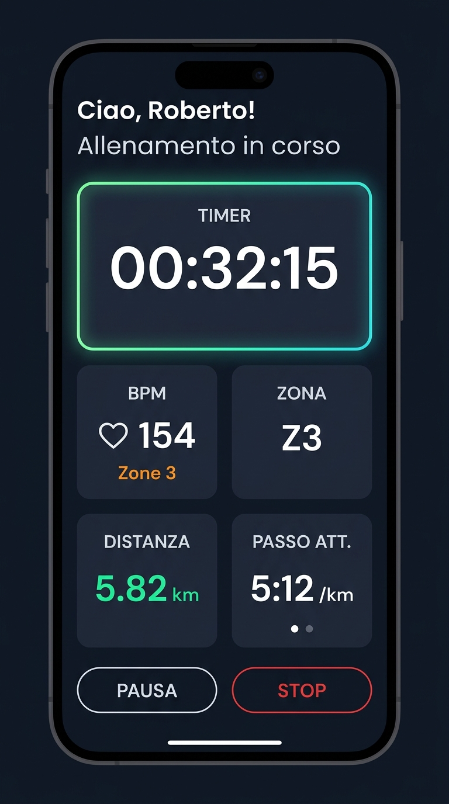
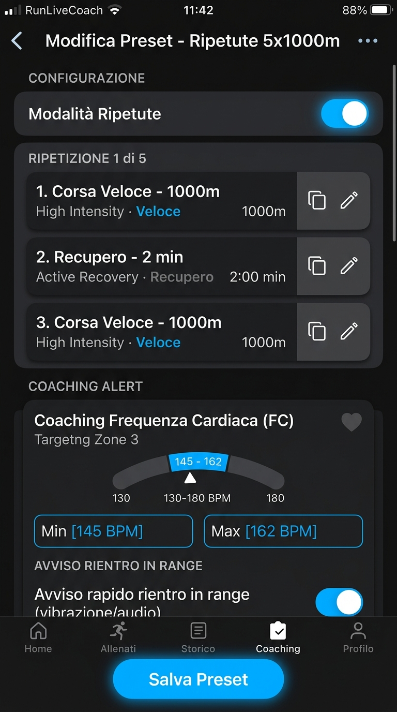
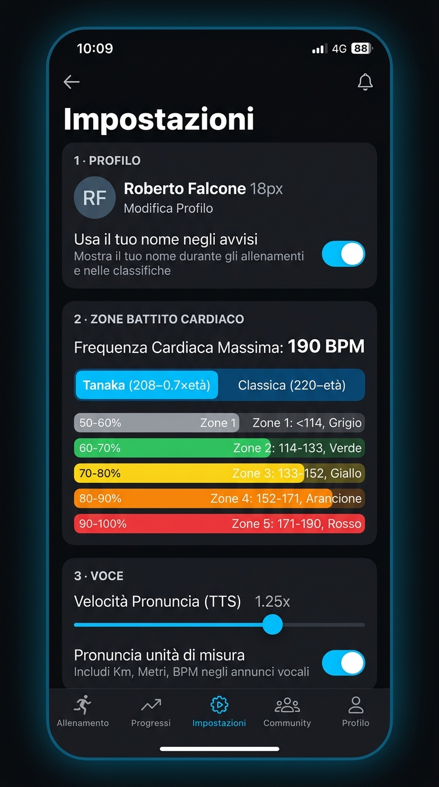

<div align="center">

  

  # RunLiveCoach 🏃‍♂️🎧
  ### *L'Assistente Vocale Intelligente per la Corsa & Interval Training*

  [](https://flutter.dev)
  [](https://dart.dev)
  [](https://android.com)
  [](LICENSE)

  <p align="center">
    <b>Un'esperienza di corsa a mani libere e zero distrazioni.</b><br>
    Metriche in tempo reale, coaching vocale su frequenza cardiaca/passo e gestione completa delle ripetute, tutto guidato dalla voce senza dover guardare lo schermo.
  </p>

</div>

---

## 📱 Screenshots dell'Applicazione

<div align="center">
  <table>
    <tr>
      <td align="center" width="33%">
        <b>⚡ Live Workout Dashboard</b><br><br>
        <br><br>
        <em>Timer, BPM dinamico, Zone FC, Distanza e box Passo slidabile (attuale/medio).</em>
      </td>
      <td align="center" width="33%">
        <b>🎯 Editor Ripetute & Coaching</b><br><br>
        <br><br>
        <em>Sequenze di ripetute a step, target BPM numerici e avviso rientro in soglia.</em>
      </td>
      <td align="center" width="33%">
        <b>⚙️ Zone Cardio & Voce</b><br><br>
        <br><br>
        <em>Calcolo Tanaka/Classico HR Max, Zone Z0-Z5 personalizzabili e opzioni TTS.</em>
      </td>
    </tr>
  </table>
</div>

---

## 🌟 Caratteristiche Principali

### 🎧 1. Assistente Vocale Smart (Audio Ducking & Focus)
* **Feedback vocale naturale:** Annunci vocali intelligenti con gestione grammaticale corretta in italiano (*B P M*, plurali e singolari dinamici).
* **Audio Ducking:** Quando l'assistente parla, abbassa temporaneamente il volume della tua musica o dei podcast senza interromperli.
* **Saluto personalizzato:** Opzione per farsi chiamare per nome all'inizio di ogni sessione di corsa.

### 🏃‍♂️ 2. Gestione Avanzata Ripetute (Interval Training)
* **Super Profili:** Configura step alternati (es. *1000m veloci + 2 min recupero*) basati su distanza o tempo.
* **Duplicazione rapida:** Crea routine complesse con pochi tocchi duplicando i singoli step.
* **Notifiche di transizione:** La voce ti segnala automaticamente il cambio di fase e l'obiettivo da mantenere.

### ❤️ 3. Monitoraggio Cardio BLE & Calcolo Zone Reali
* **Connessione BLE universale:** Compatibile con fasce cardio (Polar, Garmin) e dispositivi in broadcast HR (Whoop, smartwatch).
* **Formule Tanaka & Classica:** Calcolo automatico della frequenza cardiaca massima ($208 - 0.7 \times \text{età}$ oppure $220 - \text{età}$).
* **6 Zone Cardiache (Zona 0 - Zona 5):** Soglie totalmente personalizzabili con aggiornamento a cascata.

### 🎯 4. Coaching Zone Proattivo
* **Controllo Range:** Imposta target di frequenza cardiaca (BPM o Zona) o di passo.
* **Avvisi fuori range:** Se esci dalla soglia target, il coach ti avvisa dopo un ritardo configurabile (*es. 10s*).
* **Avviso rapido di rientro:** Ricevi subito conferma quando sei tornato nella frequenza corretta senza aspettare l'intervallo completo.

### 📍 5. GPS Anti-Dropout & Tracciamento in Background
* **Foreground Service Android:** Servizio in primo piano con notifica persistente per evitare che il sistema operativo uccida il GPS a schermo spento.
* **Bypass Battery Optimization:** Richiesta guidata dei permessi per impedire lo sleep forzato su dispositivi Samsung, Xiaomi, Huawei, etc.
* **Passo Istantaneo e Medio Slidabile:** Riquadro interattivo nella schermata principale per passare con uno swipe dal passo istantaneo al passo medio globale.

---

## 🏗️ Architettura Software

Il progetto adotta un'architettura modulare e pulita costruita attorno al **Provider Pattern** di Flutter e a Service Layer disaccoppiati:

```
lib/
├── models/               # Entità dati e configurazioni
│   ├── alert_config.dart     # Modelli per Avvisi Periodici & Coaching
│   ├── heart_rate_zone.dart  # Definizione e soglie delle Zone Cardio (0-5)
│   ├── preset.dart           # Preset di allenamento e Step Ripetute
│   └── user_profile.dart     # Profilo utente, formule FC e impostazioni TTS
├── providers/            # State Management (ChangeNotifier)
│   ├── bluetooth_provider.dart
│   ├── location_provider.dart
│   ├── preset_provider.dart
│   ├── tts_provider.dart
│   ├── user_provider.dart
│   └── workout_provider.dart
├── screens/              # Schermate dell'applicazione
│   ├── preset_editor_screen.dart # Editor avanzato preset e ripetute
│   ├── settings_screen.dart      # Profilo, Zone Cardio e Voce
│   └── training_screen.dart      # Dashboard live allenamento e avvio
├── services/             # Layer di I/O, Sensori e Logica di Background
│   ├── bluetooth_service.dart # Scanner BLE e parser pacchetti Heart Rate
│   ├── location_service.dart  # Geolocator + Android Foreground Service
│   ├── tts_service.dart       # Coda FIFO e sintesi vocale FlutterTTS
│   └── workout_service.dart   # Engine di allenamento, tick timer e regole alert
└── utils/                # Costanti, palette colori e formule HR (Tanaka)
```

---

## 🚀 Come Eseguire il Progetto

### Prerequisiti
* [Flutter SDK](https://flutter.dev/docs/get-started/install) (versione `>= 3.11.4`)
* [Android Studio](https://developer.android.com/studio) / Android SDK con supporto Android 13+ (API 33+)
* Dispositivo fisico Android con Bluetooth e GPS abilitati (consigliato per testare BLE e GPS).

### Installazione

1. **Clona la repository:**
   ```bash
   git clone https://github.com/RobFalc99/RunVoice.git
   cd RunVoice
   ```

2. **Installa le dipendenze:**
   ```bash
   flutter pub get
   ```

3. **Avvia l'app in modalità Debug:**
   ```bash
   flutter run
   ```

4. **Compila l'APK di produzione:**
   ```bash
   flutter build apk --release
   ```
   L'APK generato sarà disponibile in:
   `build/app/outputs/flutter-apk/app-release.apk`

---

## 🛡️ Permessi Richiesti su Android

Per garantire il funzionamento ininterrotto durante la corsa:
* `ACCESS_FINE_LOCATION` & `ACCESS_BACKGROUND_LOCATION`: Per la rilevazione continua della distanza e del passo GPS.
* `FOREGROUND_SERVICE` & `FOREGROUND_SERVICE_LOCATION`: Per mantenere attivo il tracking anche quando lo smartphone è in tasca con display bloccato.
* `POST_NOTIFICATIONS`: Obbligatorio su Android 13+ per consentire al servizio Foreground di rimanere attivo.
* `BLUETOOTH_SCAN` & `BLUETOOTH_CONNECT`: Per l'accoppiamento a fasce cardio e sensori cardiaci BLE.
* `REQUEST_IGNORE_BATTERY_OPTIMIZATIONS`: Per escludere l'app dalle limitazioni aggressive sul consumo energetico.

---

## 📄 Licenza

Distribuito sotto licenza **MIT**. Consulta il file `LICENSE` per ulteriori informazioni.

---

<div align="center">
  Sviluppato con passione per i runner da <b>Roberto Falcone</b> 🏃‍♂️💨
</div>
